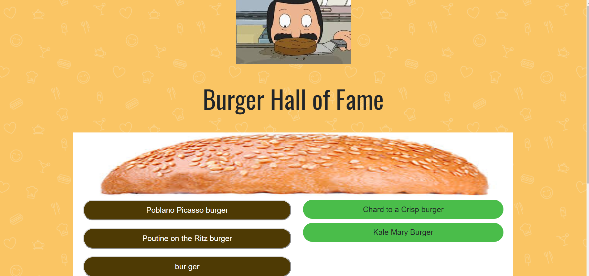

# burger

## The Burger Hall of Fame: A tribute to the best burgers of Bob's Burgers

This is a fun little app that lists the some of the best burger puns from the TV show Bob's Burgers and allows the user to try their hand at coming up with their own.

The main page is a pretty simple display of the current list of burgers saved to the server. The list stays on the server, where anyone who visits the site can appreciate your handiwork. There is also function where the user can "try" each legendary burger by clicking on it, moving it from the "ready to eat" column on the left, to the static "eaten" column on the right. 

*This aspect is currently not functional*

To add a new burger, the user only needs to type in their totally original and worthy idea into the input space and submit it with the "Add the Burger" button.

Once the button is pressed, the list will be updated withe user's submission.

# Link to deployed page:

    - https://safe-hollows-35552.herokuapp.com/

# Technologies Used

- HTML
- CSS
- Bootstrap
- JavaScript
- node.js
- body-parser.js
- Express.js
- handlebars

Author

John Caldwell